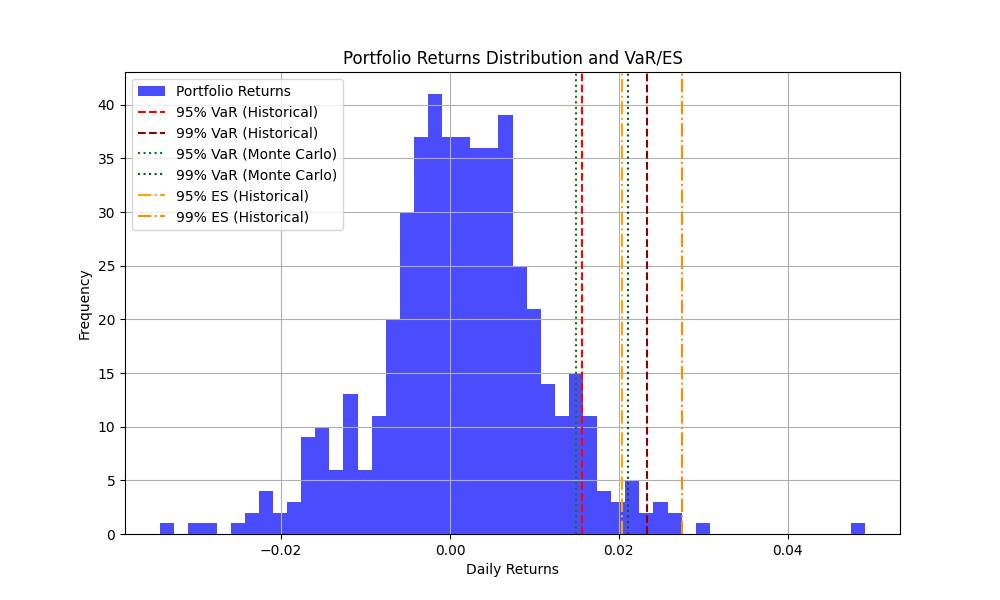

# Value at Risk (VaR) Model

## Project Overview
This project develops a Value at Risk (VaR) model to assess the risk of a portfolio with AAPL, MSFT, and JPM stocks. It uses Historical and Monte Carlo methods to calculate 95% and 99% VaR, and includes Expected Shortfall (ES) for a deeper risk analysis. The visualization highlights the distribution of returns and risk thresholds, making it a practical tool for financial risk management.

## Methodology
- Fetched historical stock data using yfinance (2023-2025).
- Calculated daily returns and portfolio returns with weights (40% AAPL, 40% MSFT, 20% JPM).
- Computed VaR using Historical (percentile) and Monte Carlo (10,000 simulations) methods.
- Added ES to measure tail risk.

## Results and Analysis
- **Historical VaR**:
  - 95% VaR: 1.56% (maximum potential daily loss with 95% confidence).
  - 99% VaR: 2.34% (maximum potential daily loss with 99% confidence).
- **Monte Carlo VaR**:
  - 95% VaR: 1.47% (slightly lower due to simulation).
  - 99% VaR: 2.15% (overall close to historical, with a small difference).
- **Expected Shortfall (ES)**:
  - 95% ES: 2.03% (average loss beyond the 95% VaR).
  - 99% ES: 2.75% (average loss beyond the 99% VaR).
- **Observations**:
  - The values are reasonable for a stock portfolio (AAPL, MSFT, JPM) and indicate that the model works correctly.
  - The ES is higher than the VaR, as expected, because it measures the average loss in the tail of the distribution.
  - The differences between Historical and Monte Carlo methods are small, which is normal with 10,000 simulations.

## Visualization

